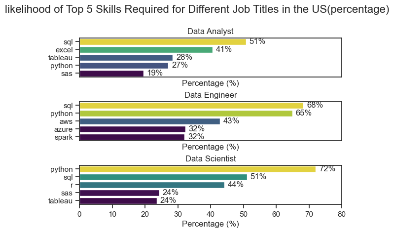
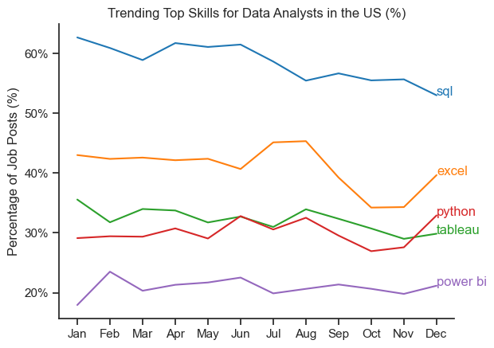

# The Analysis
 
## 1. what are the most demanded skills fir the top 3 most popular data roles?

To find the most demanded skills for the top 3 most popular data roles. I finitered out those positions by which ones were the most popular, and got the top 5 skills for these top 3 roles. This query highlight the most popular job titles and their top skills, showing which skills I should pay attention to depending on the role I'm targeting.

View my notebook with detailed steps here: [skill_count.ipynb](skills_count.ipynb)

### Visualize Data
```python
fig,ax =plt.subplots(len(job_titles),1)

sns.set_theme(style='ticks')

for i, job_title in enumerate(job_titles):
    df_plot=df_skills_perc[df_skills_perc['job_title_short']==job_title].head(5)
    sns.barplot(data=df_plot,x='skill_percent',y='job_skills',ax=ax[i],hue='skill_percent',palette='viridis')
    ax[i].set_title(job_title)
    ax[i].set_ylabel('')
    ax[i].get_legend().remove()
    ax[i].set_xlabel('Percentage (%)')
    ax[i].legend().set_visible(False)
    ax[i].set_xlim(0,80)

````
### Result


### Insight:

🔹 Data Analyst
```

SQL is the most in-demand skill (51%).

Excel remains a core requirement (41%).

Visualization tools like Tableau are moderately preferred (28%).

Python shows increasing relevance (27%).

SAS demand is comparatively low (19%).
```

🔹 Data Engineer
```

SQL (68%) and Python (65%) dominate the skillset.

Cloud technologies such as AWS and Azure show strong demand (32% each).

Big data framework Spark is equally important (32%).

Overall, Data Engineering roles emphasize backend, cloud, and large-scale systems.
````
🔹 Data Scientist
```
Python is the most required skill across all roles (72%).

SQL continues to be essential (51%).

R, SAS, and Tableau each hold moderate relevance (24%).

Demonstrates strong preference for programming and statistical tools.

```
 ## 🔍  Overall Trend Summary

SQL is universally required across all three roles.

Python dominates Data Engineer and Data Scientist roles.

Cloud + Big Data skills matter most for Data Engineers.

Analysts rely more on Excel and visualization tools like Tableau.
````
Skill demands reflect the differing focus of each role:

Analysts → Reporting & Visualization

Engineers → Data Infrastructure & Pipelines

Scientists → Modeling, ML, Experimentation
````

## 2. How are in-demand skills trending for Data Analysis?

### Visualize Data

```python
from matplotlib.ticker import PercentFormatter

sns.lineplot(data=df_DA_US_percent.iloc[:, :5],dashes=False,palette="tab10")
sns.set_theme(style='ticks')

plt.title('Trending Top Skills for Data Analysts in the US (%)')
plt.ylabel('Percentage of Job Posts (%)')   
plt.xlabel('')
plt.legend().remove()
sns.despine()
plt.gca().yaxis.set_major_formatter(PercentFormatter(decimals=0))
for i in range(5):
    plt.text(11, df_DA_US_percent.iloc[11, i] 
             , df_DA_US_percent.columns[i], color=sns.color_palette("tab10")[i])

plt.show()
```
### Results


*Line graph visualizng the trending top skills for data analyst in the US*


### Insight:
```

🔹 1. SQL remains the most in-demand skill

Consistently leads at 55–63% of all data analyst job postings.

Shows slight decline mid-year but maintains clear dominance.

Indicates SQL is a non-negotiable foundational skill.
```
```
🔸 2. Excel stays strong and stable

Second-most required skill at 34–45%.

Peaks around July–August, likely reflecting business reporting cycles.

Continues to be a core skill despite modern tools.
```
```
🟢 3. Tableau demand fluctuates

Moves between 28–36% across the year.

Slight surge during mid-year suggests increased hiring for BI/reporting roles.
```
```
🔴 4. Python demand shows a steady mid-year rise

Ranges from 28–34%.

Growth in June–July aligns with expanding need for automation and advanced analytics.

Closing months show renewed upward trend.
```
```
🟣 5. Power BI grows steadily throughout the year

Starts near 18% and rises towards 22–23%.

Slower but consistent adoption—reflecting Microsoft ecosystem expansion.
```

## 3.How well do jobs and skills pay for Data Analysts?

 To identfy the highest-paying roles and skills, I only got jobs in the United States and looked at their median salary. But first I looked at the salary distributions of common data jobs like Data Scientist, Data Engineer, and Data Analyst, to get an idea of which jobs are paid the most.

 view my notebook with detailed steps here: [salary_analysis.ipynb](salary_analysis.ipynb)


#### Visualize Data 

```python
sns.boxplot(data=df_US_top6, x='salary_year_avg', y='job_title_short', order=job_order)

ticks_x = plt.FuncFormatter(lambda y, pos: f'${int(y/1000)}K')
plt.gca().xaxis.set_major_formatter(ticks_x)
plt.show()

```


### Results

  
*Box plot visualizing the salary distributions for the top 6 data job titles.*


#### Insights

- There's a significant variation in salary ranges across different job titles. Senior Data Scientist positions tend to have the highest salary potential, with up to $600K, indicating the high value placed on advanced data skills and experience in the industry.

- Senior Data Engineer and Senior Data Scientist roles show a considerable number of outliers on the higher end of the salary spectrum, suggesting that exceptional skills or circumstances can lead to high pay in these roles. In contrast, Data Analyst roles demonstrate more consistency in salary, with fewer outliers.

- The median salaries increase with the seniority and specialization of the roles. Senior roles (Senior Data Scientist, Senior Data Engineer) not only have higher median salaries but also larger differences in typical salaries, reflecting greater variance in compensation as responsibilities increase.

### Highest Paid & Most Demanded Skills for Data Analysts

Next, I narrowed my analysis and focused only on data analyst roles. I looked at the highest-paid skills and the most in-demand skills. I used two bar charts to showcase these.


#### Visualize Data

```python

fig, ax = plt.subplots(2, 1)  

# Top 10 Highest Paid Skills for Data Analysts
sns.barplot(data=df_DA_top_pay, x='median', y=df_DA_top_pay.index, hue='median', ax=ax[0], palette='dark:b_r')

# Top 10 Most In-Demand Skills for Data Analystsr'
sns.barplot(data=df_DA_skills, x='median', y=df_DA_skills.index, hue='median', ax=ax[1], palette='light:b')

plt.show()

```


#### Results
Here's the breakdown of the highest-paid & most in-demand skills for data analysts in the US:


*Two separate bar graphs visualizing the highest paid skills and most in-demand skills for data analysts in the US.*

#### Insights:

- The top graph shows specialized technical skills like `dplyr`, `Bitbucket`, and `Gitlab` are associated with higher salaries, some reaching up to $200K, suggesting that advanced technical proficiency can increase earning potential.

- The bottom graph highlights that foundational skills like `Excel`, `PowerPoint`, and `SQL` are the most in-demand, even though they may not offer the highest salaries. This demonstrates the importance of these core skills for employability in data analysis roles.

- There's a clear distinction between the skills that are highest paid and those that are most in-demand. Data analysts aiming to maximize their career potential should consider developing a diverse skill set that includes both high-paying specialized skills and widely demanded foundational skills.